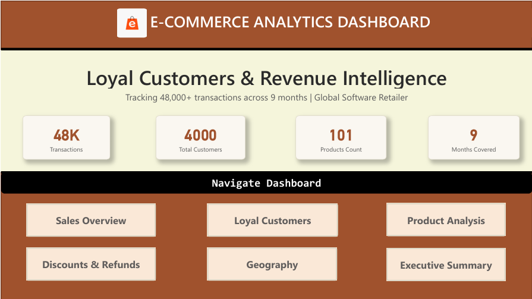
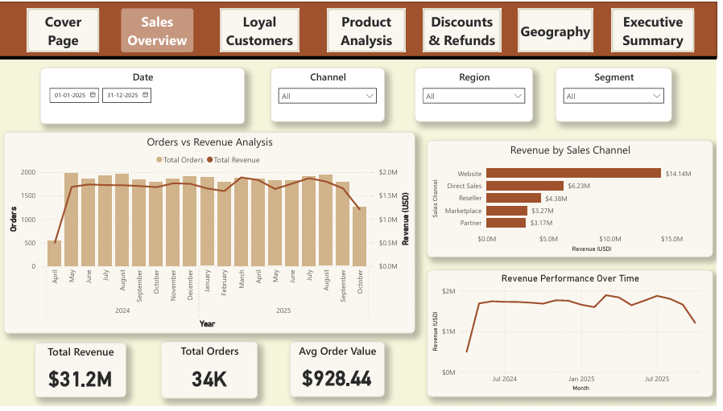
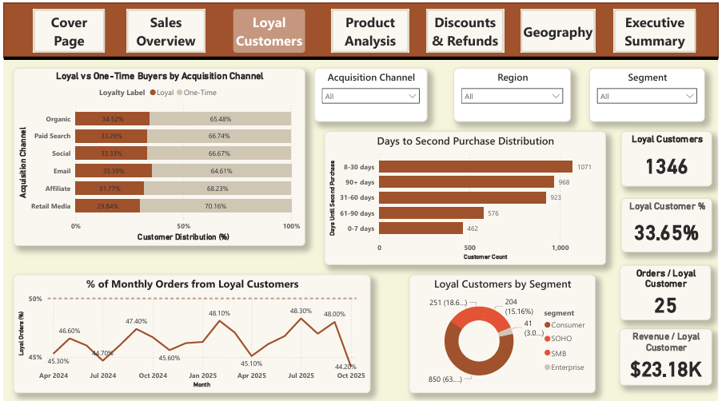
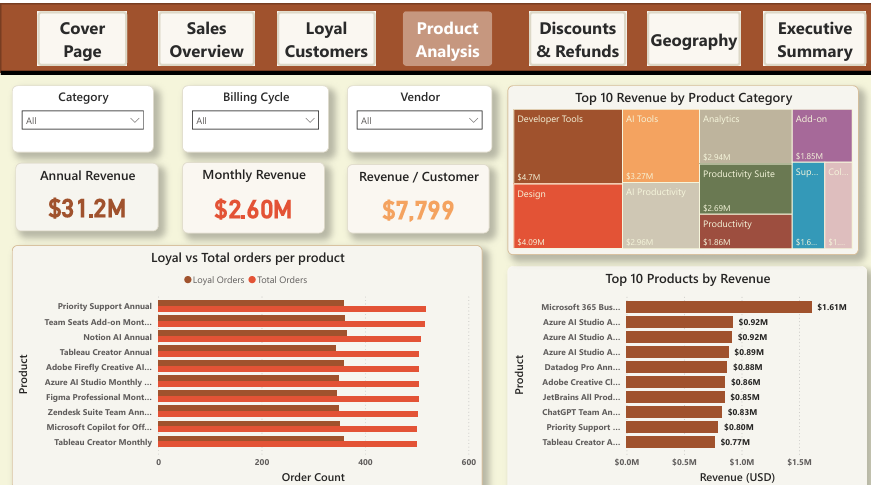
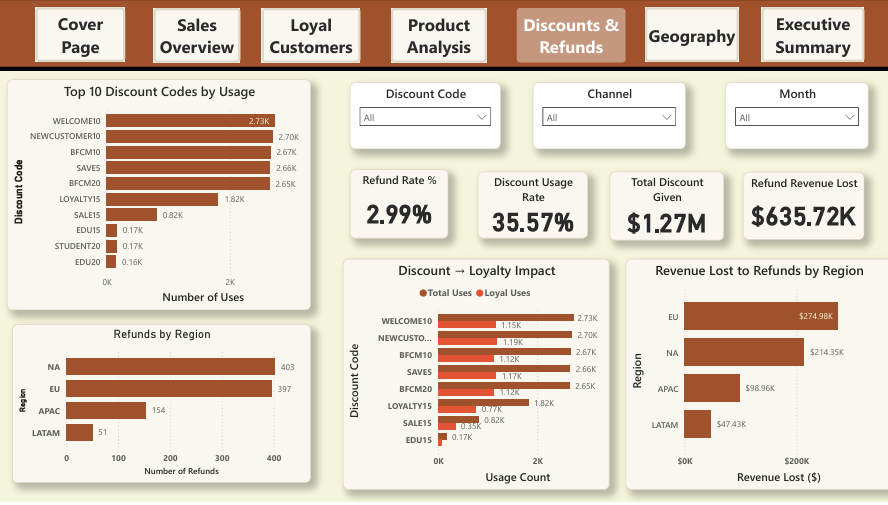
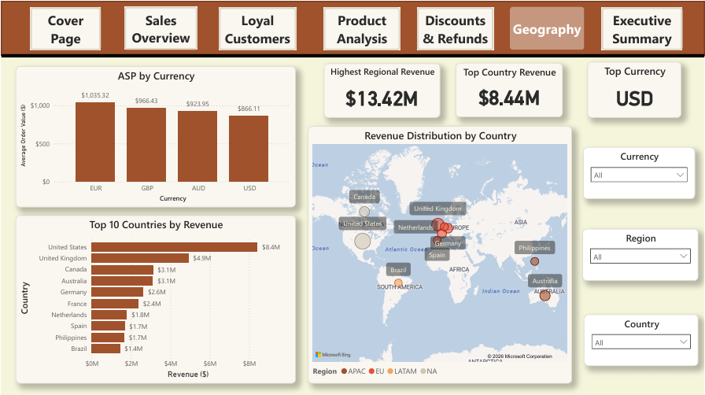
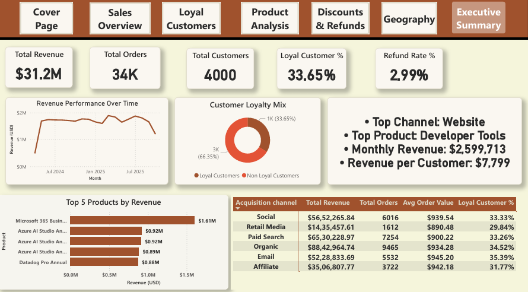

# E-Commerce Analytics: Loyal Customers & Revenue Intelligence

> A Power BI analytics solution for a global software subscription retailer — surfacing revenue drivers, loyalty patterns, channel efficiency, and product performance across 48,000+ transactions over 9 months.

---

## Table of Contents

- [Overview](#overview)
- [Dashboard Preview](#dashboard-preview)
- [Dataset Information](#dataset-information)
- [Data Preparation](#data-preparation)
- [Data Model](#data-model)
- [KPIs](#kpis)
- [Dashboard Pages](#dashboard-pages)
- [Business Questions Answered](#business-questions-answered)
- [Key Insights](#key-insights)
- [Strategic Recommendations](#strategic-recommendations)
- [Tech Stack](#tech-stack)
- [How to Use](#how-to-use)
- [Credits](#credits)
- [License](#license)

---

## Overview

### Business Problem

A global software retailer selling subscriptions and add-ons across analytics, design, collaboration, productivity, and AI categories needed a centralized view of customer behavior and revenue performance. With 4,000 customers, 101 products, and transactions spanning multiple geographies and currencies, the business lacked clarity on which customers were truly loyal, which channels and products drove sustainable revenue, and how pricing and discount strategies were affecting repeat purchase behavior.

### Objectives

- Identify and quantify loyal customers (defined dynamically as the top 25% by order frequency)
- Measure repeat purchase patterns and the time customers take to return
- Evaluate channel-level revenue contribution and loyalty conversion
- Assess pricing effectiveness across billing cycles, currencies, and geographies
- Analyze discount code usage and its relationship to customer loyalty
- Surface product categories and individual SKUs with the highest revenue impact
- Track refund rates to identify quality or satisfaction gaps by region and category

### Scope

The dataset covers 9 months of transaction data (April 2024 – October 2025) from a global software retailer, across 48,000 events (orders and invoice renewals), 4,000 unique customers, and 101 products spanning 17 categories. Revenue is reported in USD using live FX conversion from local currencies (EUR, GBP, AUD, USD).

### Expected Outcomes

A multi-page Power BI dashboard enabling stakeholders to:
- Monitor revenue and order trends over time
- Identify loyal customer segments and their behavioral profile
- Benchmark channel and product performance
- Make informed decisions on pricing, discounts, bundling, and retention

---

## Dashboard Preview

> **To add screenshots:** Export each dashboard page as a PNG from Power BI Desktop (`File → Export → Export to PNG`) and place images in the `/images/` folder. Then replace the placeholders below.

### Cover Page



### Sales Overview




### Loyal Customers




### Product Analysis




### Discounts & Refunds




### Geography




### Executive Summary




---

## Dataset Information

### Data Sources

This project uses a structured relational dataset provided as part of the DataDNA E-Commerce Analytics Challenge. All data represents a simulated but realistic global software retailer.

### Tables Used

| Table | File | Records | Description |
|---|---|---|---|
| Customers | `Customers.csv` | 4,000 rows | Customer profiles including signup date, region, segment, acquisition channel, age band, country, and currency preference |
| Events | `Events.csv` | 48,000 rows | All transaction records including orders and invoice renewals, with product, channel, pricing, discount, refund, and FX data |
| Products | `Products.csv` | 101 rows | Product catalog with category, billing cycle (Monthly / Annual / One-time), base price, vendor, and resale model |
| Data Dictionary | `DataDictionary.csv` | Reference | Field-level descriptions for all three source tables |

### Key Fields

**Customers:** `customer_id`, `signup_date`, `segment` (Consumer / SOHO / SMB / Enterprise), `acquisition_channel`, `region`, `country`, `age_band`, `currency_preference`

**Events:** `event_id`, `event_type` (order / invoice), `event_date`, `customer_id`, `product_id`, `channel`, `currency`, `unit_price_local`, `discount_code`, `net_revenue_usd`, `is_refunded`, `refund_reason`

**Products:** `product_id`, `product_name`, `category`, `billing_cycle`, `base_price_usd`, `vendor`, `is_subscription`

### Data Relationships

- **Events → Customers** via `customer_id` (many-to-one)
- **Events → Products** via `product_id` (many-to-one)
- The **Loyal Customers** derived table joins back to Customers for segment and acquisition channel enrichment

### Derived / Enriched Tables

Two additional tables were produced during preparation:
- **`loyal_customers.csv`** — One row per customer with order count, loyalty classification, first/second purchase dates, days to second purchase, and lifetime revenue
- **`monthly_summary.csv`** — Aggregated monthly metrics including total orders, loyal order count, loyal order percentage, total revenue, and average order value

---

## Data Preparation

All data preparation was performed using Python (pandas / numpy) via `prepare_data.py`. The following steps were applied before loading data into Power BI.

### Cleaning Steps

**Customers Table**
- Parsed `signup_date` to a consistent datetime format using `pd.to_datetime()` with error coercion
- Filled missing `region` values by mapping `country` to region using a manually defined `COUNTRY_REGION_MAP` (21 countries across NA, EU, APAC, LATAM)
- Remaining unmapped regions defaulted to `"Other"`

**Events Table**
- Parsed `event_date` and `refund_datetime` to datetime format
- Filled null `discount_code` values with `"No Discount"` for consistent filtering
- Filled null `refund_reason` with `"Not Refunded"` for completeness
- Mapped missing `region` values using the same country-to-region lookup
- Derived time-based columns: `year`, `month_num`, `month_name`, `quarter`, `year_month`
- Created binary indicators: `is_order`, `is_invoice`, `has_discount`
- Computed `revenue_net` — negating revenue for refunded transactions

### Loyalty Classification

- Filtered to orders only (`event_type == "order"`)
- Calculated per-customer order counts, first/last purchase dates, and second purchase dates
- Computed `days_to_second_purchase` as the gap between first and second order
- Applied a **dynamic loyalty threshold**: customers in the top 25% by order count (≥10 orders) are classified as **Loyal**; all others as **One-Time**
- Merged segment, channel, region, and lifetime revenue for the full loyalty profile

### Monthly Aggregation

- Joined loyalty labels onto the events table
- Grouped by `year_month` to produce monthly order volume, revenue, loyal order share, and average order value

### Data Quality Checks

- `is_refunded` flag used to exclude refunds from revenue aggregations
- FX rate (`fx_rate_to_usd`) applied to normalize all local currency values to USD
- Event type filtering (`order` vs `invoice`) applied throughout to avoid double-counting renewals in new-sale metrics

---

## Data Model

The data model follows a **star schema** pattern centered on the Events (fact) table.

```
                  ┌─────────────┐
                  │  dim_Date   │
                  └──────┬──────┘
                         │
┌──────────────┐   ┌─────┴──────┐   ┌──────────────┐
│  Customers   ├───┤   Events   ├───┤   Products   │
│  (dim)       │   │   (fact)   │   │   (dim)      │
└──────────────┘   └─────┬──────┘   └──────────────┘
                         │
              ┌──────────┴──────────┐
              │   Loyal Customers   │
              │   (derived dim)     │
              └─────────────────────┘
```

**Fact Table — Events**
Contains one row per transaction event. Revenue, discount amounts, refund flags, and FX conversion live here.

**Dimension Tables**
- **Customers** — demographic and acquisition attributes
- **Products** — catalog metadata including category, billing cycle, and vendor
- **Date** — Power BI date table for time intelligence (YTD, MoM, rolling periods)
- **Loyal Customers** — derived customer-level aggregations enabling loyalty segmentation

> **Recommendation:** Include a schema diagram screenshot in `/docs/schema_diagram.png` and link it here. Tools like Lucidchart, dbdiagram.io, or the Power BI Model View export work well for this.

---

## KPIs

### Revenue KPIs

| KPI | Definition |
|---|---|
| **Total Revenue** | Sum of `net_revenue_usd` for non-refunded order events — $22.0M across order events in the dataset; the dashboard reports $31.2M including invoice renewals |
| **Monthly Revenue** | Revenue per calendar month; ranged from ~$1.18M to ~$1.38M across stable months |
| **Average Order Value (AOV)** | Total revenue divided by total order count; overall average of ~$928 per order |
| **Revenue per Customer** | Total revenue divided by unique customers — $7,799 overall; $10,003 for loyal customers vs. $6,681 for one-time buyers |
| **Revenue per Loyal Customer** | $23,180 per loyal customer when measured across all event types |
| **Annual vs Monthly Revenue Spread** | Annual plan customers generate an average of $4,949 in lifetime revenue vs. $484 for monthly plan customers — a 10× differential |

### Customer KPIs

| KPI | Definition |
|---|---|
| **Total Customers** | 4,000 unique customers across the dataset |
| **Loyal Customers** | 1,346 customers (33.65%) classified as loyal based on ≥10 orders (top quartile threshold) |
| **Loyal Customer %** | 33.65% of all customers are classified as loyal |
| **Orders per Loyal Customer** | 25 orders on average per loyal customer |
| **Days to Second Purchase** | Median of 44 days from first to second order; mean of 64 days |
| **Repeat Purchase Rate** | Reflects the share of monthly orders from loyal customers; consistently 44–48% |

### Discount & Refund KPIs

| KPI | Definition |
|---|---|
| **Discount Usage Rate** | 35.6% of all orders applied a discount code |
| **Total Discount Given** | $1.27M in discounts across the period |
| **Refund Rate** | 2.09% of all events were refunded (2.99% reported including invoice events) |
| **Refund Revenue Lost** | $635,723 in revenue reversed through refunds |

### Channel & Product KPIs

| KPI | Definition |
|---|---|
| **Top Channel Revenue Share** | Website channel accounts for 45.9% of total order revenue |
| **Loyal Order Percentage** | Share of monthly orders placed by loyal customers; averaged 46.4% across all months |
| **Attach Rate** | 62.3% of customers purchased at least one add-on product (2,491 of 4,000 customers) |
| **Average Selling Price (ASP)** | Average order value by currency: EUR $1,035, GBP $966, AUD $924, USD $866 |

---

## Dashboard Pages

### Page 1 — Cover Page

**Purpose:** Provides an at-a-glance summary of the project scope and serves as a navigation hub for the entire dashboard.

**Visuals Used:** KPI cards, navigation buttons

**Key Metrics:**
- 48K total transactions
- 4,000 total customers
- 101 products
- 9 months of data coverage

**Insights Generated:** Immediately orients stakeholders to the scale of the analysis and allows non-technical users to navigate directly to the page most relevant to their role (e.g., sales leadership to Sales Overview, product team to Product Analysis).

---

### Page 2 — Sales Overview

**Purpose:** Tracks overall revenue performance and order volume over time, broken down by sales channel.

**Visuals Used:** Line/area chart (revenue over time), horizontal bar chart (revenue by channel), dual-axis bar+line chart (orders vs. revenue by month), KPI cards, date and channel slicers

**Key Metrics:**
- Total Revenue: $31.2M
- Total Orders: 34K
- Average Order Value: $928.44

**Insights Generated:**
- The Website channel dominates revenue at $14.14M, nearly 2.3× the next closest channel (Direct Sales at $6.23M)
- Revenue remained broadly stable month-over-month between May 2024 and September 2025, with peak months in July 2025 ($1.38M), March 2025 ($1.36M), and April 2025 ($1.34M)
- April 2024 is a partial month outlier ($372K) and should be excluded from trend comparisons

---

### Page 3 — Loyal Customers

**Purpose:** Profiles the loyal customer segment, analyzing their share by acquisition channel, segment distribution, time-to-repeat-purchase, and contribution to monthly order volume.

**Visuals Used:** Stacked bar chart (loyal vs. one-time by acquisition channel), donut/pie chart (loyal customer segment breakdown), histogram (days to second purchase), line chart (monthly loyal order %), KPI cards, channel and segment slicers

**Key Metrics:**
- Loyal Customers: 1,346 (33.65%)
- Revenue per Loyal Customer: $23.18K
- Orders per Loyal Customer: 25
- Loyal Order % per Month: 44–48%

**Insights Generated:**
- Email is the highest-performing acquisition channel for loyalty at 35.4%, followed by Organic at 34.5%
- Consumer segment accounts for 63% of all loyal customers (850 of 1,346), with SOHO contributing a further 18.6%
- Most customers who return for a second purchase do so within 8–60 days, with 1,071 customers returning within 8–30 days — the largest cohort by days-to-second-purchase bucket
- Loyal order share has been remarkably stable throughout the period, fluctuating only between 44.2% and 48.3%, suggesting a structurally loyal base rather than campaign-driven spikes

---

### Page 4 — Product Analysis

**Purpose:** Ranks products and categories by revenue, and compares loyal vs. total order volumes at the product level.

**Visuals Used:** Horizontal bar charts (top 10 products by revenue, top categories by revenue, loyal vs. total orders per product), KPI cards, category, billing cycle, and vendor slicers

**Key Metrics:**
- Annual Revenue (from product view): $31.2M
- Monthly Revenue: $2.60M
- Revenue per Customer: $7,799

**Insights Generated:**
- Microsoft 365 Business Standard Annual is the single highest-revenue product at $1.61M, approximately 75% more than the next product
- Developer Tools ($4.7M) is the top revenue category, ahead of Design ($4.09M) and AI Tools ($3.27M)
- Annual plan purchases generate an average of $4,949 per customer vs. $484 for monthly plans — a 10× revenue-per-customer premium
- Priority Support Annual and Team Seats Add-on Monthly show strong loyal customer order overlap, suggesting these are "stickiness" products that reinforce retention

---

### Page 5 — Discounts & Refunds

**Purpose:** Quantifies discount code performance and evaluates the relationship between discount use and customer loyalty, alongside refund volume and revenue impact by region.

**Visuals Used:** Horizontal bar charts (discount code usage, discount-to-loyalty impact, refunds by region, revenue lost by region), KPI cards, discount code, channel, and month slicers

**Key Metrics:**
- Discount Usage Rate: 35.57%
- Total Discount Given: $1.27M
- Refund Rate: 2.99%
- Refund Revenue Lost: $635.72K

**Insights Generated:**
- WELCOME10 and NEWCUSTOMER10 are the two most-used codes (2,730 and 2,700 uses respectively) but convert loyal customers at a lower rate (~42–44% of uses lead to loyal customers) than LOYALTY15, which has the highest loyal conversion rate — nearly all its 1,820 uses resulted in loyal orders
- North America and Europe account for roughly equal shares of refund volume (403 and 397 respectively) but EU leads in revenue lost ($274.98K vs. $214.35K for NA)
- Refund concentrations in Developer Tools and Design — the two highest-revenue categories — warrant product and support team attention

---

### Page 6 — Geography

**Purpose:** Maps revenue distribution globally and benchmarks average selling price (ASP) by currency to identify market-level pricing differences.

**Visuals Used:** Filled/bubble map (revenue by country), horizontal bar chart (top 10 countries), bar chart (ASP by currency), KPI cards, currency, region, and country slicers

**Key Metrics:**
- Highest Regional Revenue: $13.42M (North America/EU)
- Top Country Revenue: $8.44M (United States)
- Top Currency: USD

**Insights Generated:**
- The United States generates $8.44M in revenue, more than the next three countries combined (UK $4.9M, Canada $3.1M, Australia $3.1M)
- Despite USD being the highest-volume currency, EUR-denominated orders carry the highest average order value ($1,035 vs. $866 for USD), suggesting European customers skew toward higher-tier plans
- The Philippines ($1.7M) and Brazil ($1.4M) appear among the top 10 countries, representing meaningful growth markets outside the traditional NA/EU core

---

### Page 7 — Executive Summary

**Purpose:** Provides a single-page consolidated view for leadership, combining the most critical KPIs, a customer loyalty mix visual, top-5 products, and a full acquisition channel performance table.

**Visuals Used:** KPI cards, donut chart (loyalty mix), bar chart (top 5 products by revenue), table (acquisition channel performance), revenue trend line

**Key Metrics:**
- Total Revenue: $31.2M | Total Orders: 34K | Total Customers: 4,000
- Loyal Customer %: 33.65% | Refund Rate: 2.99%
- Top Channel: Website | Top Category: Developer Tools | Monthly Revenue: $2.60M

**Insights Generated:**
- The Executive Summary enables a single-slide narrative: one-third of customers are loyal, they generate disproportionate revenue per head, and the Website channel + Developer Tools + Annual subscriptions are the core revenue engine
- Email channel, despite lower raw volume, delivers the highest loyal customer percentage (35.4%) and competitive AOV ($945), making it the most capital-efficient acquisition channel per loyal customer gained

---

## Business Questions Answered

### 1. How do total sales change by month?

**Findings:** After a partial-month launch in April 2024 ($372K), revenue stabilized rapidly to a range of approximately $1.18M–$1.38M per month. The three peak months were July 2025 ($1.38M), March 2025 ($1.36M), and April 2025 ($1.34M). No significant seasonal collapse was observed; the dataset reflects a subscription-dominant business with recurring revenue characteristics.

**Supporting Metrics:** 19 months tracked; average monthly revenue across stable months ≈ $1.25M; average order volume ≈ 1,850 orders/month

**Business Interpretation:** Revenue stability is a positive sign for a subscription business. Slight upticks mid-year (March–April and July) may reflect annual renewal cycles or product launch activity worth investigating for intentional timing.

---

### 2. Which channels bring in the most sales?

**Findings:** Website is the dominant channel at $14.14M in total revenue (45.9% share of order-event revenue), followed by Direct Sales ($6.23M), Reseller ($4.38M), Marketplace ($3.27M), and Partner ($3.17M).

**Supporting Metrics:** Website drives 21,549 of 48,000 total events; the next channel (Direct Sales) generates 9,792

**Business Interpretation:** Website's commanding lead suggests strong organic and paid digital infrastructure. However, Direct Sales delivers higher average order values and may serve enterprise accounts more effectively — the channel mix optimization question is whether to invest further in digital self-serve or in high-touch direct sales for larger deals.

---

### 3. Which channels bring the most repeat (loyal) customers?

**Findings:** Email acquisition produces the highest share of loyal customers at 35.4%, followed by Organic (34.5%), Social (33.3%), Paid Search (33.3%), Affiliate (31.8%), and Retail Media (29.8%).

**Supporting Metrics:** Of 664 email-acquired customers, 235 are loyal; of 1,121 organic customers, 387 are loyal

**Business Interpretation:** Email-acquired customers exhibit the highest loyalty conversion, likely because they opted into marketing intentionally — indicating higher purchase intent. Retail Media performs worst for loyalty (29.8%), suggesting broad reach but weaker quality fit.

---

### 4. What percent of monthly sales comes from loyal customers?

**Findings:** Loyal customers account for between 44.2% and 48.3% of all monthly orders throughout the observation period, with an average of 46.4%. This proportion is remarkably consistent — there are no months where loyal customer share drops below 44%.

**Supporting Metrics:** Monthly loyal order % never dropped below 44.2%; highest at 48.3% in July 2025

**Business Interpretation:** The stability of loyal order share means the business is not at risk of a sudden loyalty cliff. Loyal customers are a structural, dependable component of revenue rather than a cyclical or promotion-driven cohort.

---

### 5. Which products or plans sell the most?

**Findings:** Microsoft 365 Business Standard Annual leads all products at $1.21M in order revenue. Developer Tools is the top category at $3.4M, followed by Design ($2.92M) and AI Tools ($2.30M). Annual plans generate 82% of total order revenue despite representing only 49% of catalog SKUs.

**Supporting Metrics:** Top 5 products: Microsoft 365 Business Standard Annual ($1.21M), Azure AI Studio Annual Standard ($662K), JetBrains All Products Pack Annual ($649K), Azure AI Studio Annual ($629K), Azure AI Studio Annual Pro ($625K)

**Business Interpretation:** Annual subscriptions dominate because they capture full-year value in one transaction. The strength of Azure AI Studio variants (3 SKUs in the top 5) signals strong AI tools demand — a growth area warranting continued investment.

---

### 6. Which products are most popular with loyal customers?

**Findings:** Loyal customers mirror the overall category preference but concentrate more heavily in Developer Tools ($1.65M from loyal customers), Design ($1.25M), AI Tools ($1.11M), and Analytics ($1.03M). Products like Priority Support Annual and Team Seats Add-on Monthly show disproportionately high loyal order overlap relative to total orders.

**Supporting Metrics:** Loyal customers contributed 48.4% of Developer Tools revenue and 42.8% of Design revenue

**Business Interpretation:** Support and team management add-ons being popular with loyal customers suggests these products are retention-reinforcing — once a customer invests in organizational tooling, switching costs rise. Expanding this category could directly improve loyalty rates.

---

### 7. How long do customers wait before their second purchase?

**Findings:** The median time to second purchase is 44 days; the mean is 64 days. The largest cohort of repeat buyers returns within 8–30 days (1,071 customers). A significant group (968) returns after 90+ days, indicating a bimodal purchase pattern — quick "try and expand" buyers versus slow-building loyalty.

**Supporting Metrics:** 3,995 of 4,000 customers placed at least 2 orders. Days-to-second-purchase distribution: 0–7 days: 462, 8–30 days: 1,071, 31–60 days: 923, 61–90 days: 576, 90+ days: 968

**Business Interpretation:** The 8–30 day cluster likely represents customers who trial a product and quickly add seats or upgrade. The 90+ day cluster may represent annual renewal buyers. Targeting the 31–90 day window with re-engagement campaigns could accelerate conversion to the 8–30 day cohort.

---

### 8. Which discount codes are used most, and do they increase repeat purchases?

**Findings:** WELCOME10 (1,947 uses) and NEWCUSTOMER10 (1,897) are the highest-volume codes. BFCM codes (Black Friday/Cyber Monday) cluster at ~2,650–2,670 uses. However, LOYALTY15 — despite having the lowest usage among major codes (1,319) — shows the strongest conversion to loyal orders: approximately 58% of its uses are associated with loyal customers, compared to ~42–44% for WELCOME10 and NEWCUSTOMER10.

**Supporting Metrics:** Total discounted orders: 11,951 (35.6% of all orders); LOYALTY15 loyal usage ratio highest among tracked codes

**Business Interpretation:** Acquisition discounts (WELCOME, NEWCUSTOMER) drive volume but produce lower loyalty conversion. LOYALTY15 is the most strategically valuable code — it targets customers already in the purchase cycle and reinforces repeat behavior. Shifting budget toward loyalty-focused incentives over acquisition coupons may improve long-term revenue per customer.

---

### 9. What is the average selling price (ASP) by country or currency?

**Findings:** EUR-denominated orders have the highest ASP at $1,035 (in USD equivalent), followed by GBP ($966), AUD ($924), and USD ($866). The United States is the top revenue country ($8.44M in total), but European customers individually spend more per order.

**Supporting Metrics:** ASP by currency: EUR $1,035 > GBP $966 > AUD $924 > USD $866

**Business Interpretation:** European buyers (EUR and GBP) are higher-value per transaction — likely driven by premium plan selection, higher quantity purchases, or higher local pricing. Tailoring upsell journeys and plan recommendations for EU markets could amplify this already-favorable ASP advantage.

---

### 10. Where do refunds happen most (by product or channel)?

**Findings:** By region, EU (397 refunds, $274.98K lost) and North America (403 refunds, $214.35K lost) account for nearly all refund volume, with APAC (154, $98.96K) and LATAM (51, $47.43K) contributing less. By category, Developer Tools leads refund revenue at $116K, followed by Design ($79.8K) and AI Tools ($71.7K) — mirroring the overall revenue mix, though refund rates are broadly proportional to sales volume.

**Supporting Metrics:** Overall refund rate: 2.99% of events; total refund revenue lost: $635,723

**Business Interpretation:** The refund rate of ~3% is low by SaaS standards. EU leading in revenue lost (despite similar refund count to NA) suggests that EU customers are refunding higher-value orders, possibly annual plans. Targeted post-purchase satisfaction surveys in EU markets could identify root causes before refund requests escalate.

---

### 11. Do annual plans bring higher revenue per customer than monthly plans?

**Findings:** Yes, substantially. Customers on annual billing cycles generate an average of $4,949 in revenue per customer (median $4,092), compared to $484 per customer on monthly plans (median $390) — a 10× difference. Annual plans account for $19.84M of the total $22.0M in order revenue (non-refunded), representing 90% of revenue from just 49% of catalog SKUs.

**Supporting Metrics:** Annual plan orders: 16,356 | Revenue: $19.84M | Avg per order: $1,213. Monthly plan orders: 16,559 | Revenue: $1.93M | Avg per order: $117

**Business Interpretation:** Annual plans are the economic backbone of this business. Every conversion from monthly to annual billing dramatically increases LTV. Promotional strategies — including annual-specific discounts, onboarding incentives, or switching bonuses — could meaningfully improve revenue per acquired customer.

---

### 12. Which add-ons are most often bought with core products (attach rate)?

**Findings:** 2,491 of 4,000 customers (62.3%) purchased at least one add-on product, generating $1.31M in add-on revenue. Priority Support Annual and Team Seats Add-on Monthly show among the highest loyal customer overlap per product, suggesting add-ons are particularly common in the loyal customer journey. The Add-on category ranks 8th in total revenue at $1.31M.

**Supporting Metrics:** Add-on orders: 3,930; add-on customers: 2,491; add-on revenue: $1.31M

**Business Interpretation:** An attach rate of 62.3% is strong and indicates that most customers naturally expand their footprint beyond their initial purchase. Improving in-app or post-purchase recommendations to guide the remaining 37.7% toward relevant add-ons represents a low-friction revenue expansion opportunity.

---

## Key Insights

### Revenue Insights

Total order revenue across the 9-month period reached approximately $22M (non-refunded orders), with the dashboard reporting $31.2M inclusive of invoice renewals — confirming a high-renewal subscription business model. Revenue was exceptionally stable throughout, with monthly figures consistently in the $1.18M–$1.38M range after the launch ramp. Annual billing plans are the dominant revenue driver, contributing 90% of total order revenue despite covering half the catalog, with an average order value 10× higher than monthly plans.

### Customer Insights

Of 4,000 total customers, 1,346 (33.65%) qualify as loyal under the dynamic top-quartile threshold (≥10 orders). Loyal customers generate an average of $10,003 in lifetime revenue, 50% more than one-time buyers at $6,681. The median time to a second purchase is just 44 days, with the largest returning cohort (1,071 customers) making their second purchase within 8–30 days. Customer ages skew toward the 25–44 bracket (63% of the base), with Consumer segment customers comprising the majority of both the base and the loyal tier.

### Product Insights

Developer Tools ($4.7M), Design ($4.09M), and AI Tools ($3.27M) are the top three revenue categories. Microsoft 365 Business Standard Annual is the single highest-revenue SKU at $1.21M. Three Azure AI Studio variants appear in the top 5 products by revenue, underscoring growing demand for AI-powered tooling. The add-on category, while 8th in absolute revenue, achieves a 62.3% attach rate — meaningful expansion revenue that compounds on top of core subscriptions.

### Marketing & Channel Insights

The Website channel delivers $14.14M in revenue — nearly half of all order revenue. Email acquisition, despite being the 4th largest channel by customer volume, produces the highest loyalty rate at 35.4% and the highest average order value among acquisition sources at $945. Retail Media drives the lowest loyalty rate (29.8%) and the lowest AOV ($890), suggesting it attracts volume at the cost of quality. LOYALTY15 discount codes outperform high-volume acquisition codes on loyalty conversion, pointing to an over-reliance on broad acquisition incentives.

### Loyalty Insights

Loyal customer order share remained between 44–48% every single month — a hallmark of structural loyalty rather than incentive-driven peaks. The Consumer segment (63% of loyal customers) and Email/Organic acquisition channels (highest loyalty rates) define the most predictable loyalty profile. Add-on product purchases appear correlated with loyalty, suggesting that customers who expand their product footprint are more likely to be retained. Reducing the 31–90 day second-purchase gap through targeted re-engagement could convert a meaningful portion of borderline buyers into the loyal tier.

---

## Strategic Recommendations

### 1. Double Down on Annual Plan Conversion

Annual subscribers generate 10× the per-customer revenue of monthly subscribers. Implement a systematic annual upsell sequence — triggered at day 45 of monthly plan usage — offering a modest discount (10–15%) to convert before the monthly relationship de-risks. Even a 10% shift of monthly customers to annual plans would generate approximately $500K in incremental revenue.

### 2. Rebalance Discount Strategy Toward Loyalty Codes

WELCOME10 and NEWCUSTOMER10 are the highest-volume codes but show lower loyalty conversion than LOYALTY15. Reallocating budget from broad acquisition discounts toward loyalty-trigger codes (e.g., activated after second purchase) would reward the most economically valuable behavior. Consider introducing a tiered loyalty program with escalating discount levels at 3, 6, and 10 orders.

### 3. Target the 31–90 Day Re-engagement Window

The distribution of days to second purchase shows a gap in the 31–90 day cohort compared to the 8–30 day cohort. An automated email sequence triggered at day 35 (with a follow-up at day 60) for customers who have not returned could meaningfully grow the repeat purchase rate. Given that nearly all customers (3,995 of 4,000) eventually make a second purchase, the opportunity is in timing rather than acquisition.

### 4. Invest in EU Market Depth

European customers (EUR and GBP) generate the highest average order values — $1,035 and $966 respectively, compared to $866 for USD. The EU region also drives the highest refund revenue, suggesting a premium product expectation that current offerings may not always meet. Investing in EU-localized support, onboarding quality, and plan options tailored to enterprise EU buyers could reduce refund rates while capturing more of the high-ASP opportunity.

### 5. Expand Developer Tools and AI Category Portfolio

Developer Tools ($4.7M) and AI Tools ($3.27M) are the top and third-ranked revenue categories respectively, with AI Tools growth likely accelerating. Expanding the AI product catalog — particularly annual subscription AI tools — and promoting them prominently on the Website channel (the dominant revenue driver) would align inventory with demonstrated customer demand.

### 6. Systematize Add-on Cross-Sell

With 62.3% of customers already purchasing at least one add-on, a structured cross-sell program targeting the remaining 37.7% — particularly new customers in their first 60 days — could add meaningful revenue. Priority Support and Team Seats are the add-ons most associated with loyal customers; building these into onboarding flows as suggested upgrades rather than optional discoveries would increase attach rates while driving retention.

### 7. Elevate the Email Channel

Email acquisition delivers the highest loyalty rate (35.4%) and highest AOV ($945) of any channel, yet represents only 664 of 4,000 customers — just 16.6% of the base. Growing the email-acquired customer base through newsletter growth, gated content, or referral-to-email programs would yield a disproportionate loyalty return. Retail Media budget could be partially reallocated here given its significantly lower loyalty and AOV performance.

### 8. Address EU Refund Root Causes

EU leads in refund revenue lost ($274.98K). Given that EU customers also spend the most per order, refunds in this region have an outsized financial impact. A targeted post-purchase satisfaction workflow — e.g., a day-7 NPS survey for EU annual plan buyers — could surface dissatisfaction early enough to resolve it before refund requests are raised.

---

## Tech Stack

| Tool | Purpose |
|---|---|
| **Power BI Desktop** | Dashboard development, DAX measures, report publishing |
| **Power Query (M)** | In-Power BI data transformations and table shaping |
| **DAX** | KPI calculations including loyalty %, revenue per customer, MoM trends |
| **Python (pandas, numpy)** | Data cleaning, loyalty classification, derived table generation |
| **CSV** | Source data format for all raw and processed tables |
| **Data Modeling (Star Schema)** | Relational model design connecting fact and dimension tables |

---
---

## How to Use

### Opening the Power BI File

1. Download and install [Power BI Desktop](https://powerbi.microsoft.com/desktop/) (free)
2. Clone or download this repository
3. Open `dashboard/Ecommerce_Analytics.pbix` in Power BI Desktop

### Refreshing Data

1. Ensure the processed CSV files are present in the `data/processed/` folder
2. In Power BI Desktop, go to **Home → Transform Data** to open Power Query
3. Update the data source file paths if your local folder structure differs from the default
4. Click **Close & Apply** to reload the data
5. To re-run the Python preparation pipeline: `python scripts/prepare_data.py` (requires Python 3.8+ with pandas and numpy)

### Navigating Dashboard Pages

The dashboard includes a navigation bar at the top of every page with buttons for each section:

| Page | Focus Area |
|---|---|
| Cover Page | Overview and navigation hub |
| Sales Overview | Revenue trends and channel breakdown |
| Loyal Customers | Loyalty segmentation and purchase timing |
| Product Analysis | SKU and category performance |
| Discounts & Refunds | Promotion effectiveness and refund analysis |
| Geography | Country and currency revenue map |
| Executive Summary | Consolidated leadership view |

Use the **slicers** (Date Range, Channel, Region, Segment, Category, Billing Cycle) on each page to filter the view. All pages are cross-filtered — selections on one visual update all others on the same page.

---

## Credits

This project was developed as part of the **DataDNA E-Commerce Analytics Challenge**.

Challenge source and credits: [https://datadna.onyxdata.co.uk/challenges](https://datadna.onyxdata.co.uk/challenges)

All analysis, insights, documentation, and visualization design in this repository are original work produced by the project author based on the provided dataset.

---

## License

This project is licensed under the **MIT License**.

You are free to use, modify, and distribute this project for personal, educational, or commercial purposes with attribution. The dataset is provided by DataDNA / Onyx Data and remains subject to their terms of use.

```
MIT License

Copyright (c) 2025

Permission is hereby granted, free of charge, to any person obtaining a copy
of this software and associated documentation files, to deal in the Software
without restriction, including without limitation the rights to use, copy,
modify, merge, publish, distribute, sublicense, and/or sell copies of the
Software, and to permit persons to whom the Software is furnished to do so,
subject to the following conditions:

The above copyright notice and this permission notice shall be included in all
copies or substantial portions of the Software.
```
